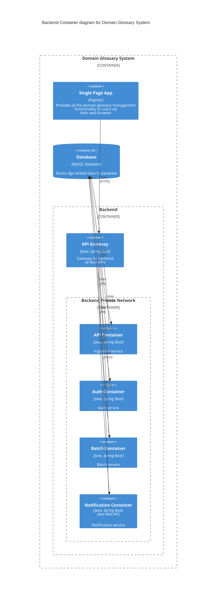

```mermaid
    C4Container
    title Backend Container diagram for Domain Glossary System

    Container_Boundary(c1, "Domain Glossary System") {
        Container(spa, "Single Page App", "Angular", "Provides all the domain glossary management <br/> functionality to users via <br/>their web browser")
        ContainerDb(dgs_db, "Database", "MySQL Database", "Stores dgs related data to database")

        Container_Boundary(c2, "Backend") {
            Container(dgs_gateway, "API Gateway", "Java, Spring Boot", "Gateway for backend <br/> all Rest APIs")

            Container_Boundary(c3, "Backend Private Network") {
                Container(dgs_api, "API Container", "Java, Spring Boot", "Ingestion service")
                Container(dgs_auth, "Auth Container", "Java, Spring Boot", "Auth service")
                Container(dgs_batch, "Batch Container", "Java, Spring Boot", "Batch service")
                Container(dgs_notificaton, "Notification Container", "Java, Spring Boot, <br/> Java Mail APi", "Notification service")
            }
        }
    }

     Rel(spa, dgs_gateway, "Uses", "HTTPS")

     Rel(dgs_gateway, dgs_api, "Uses", "HTTP")
     Rel(dgs_gateway, dgs_auth, "Uses", "HTTP")
     Rel(dgs_gateway, dgs_batch, "Uses", "HTTP")
     Rel(dgs_gateway, dgs_notificaton, "Uses", "HTTP")

     Rel(dgs_api, dgs_db, "Uses", "JPA")
     Rel(dgs_auth, dgs_db, "Uses", "JPA")
     Rel(dgs_batch, dgs_db, "Uses", "JPA")
     Rel(dgs_notificaton, dgs_db, "Uses", "JPA")


    UpdateLayoutConfig($c4ShapeInRow="4", $c4BoundaryInRow="1")
    
```
