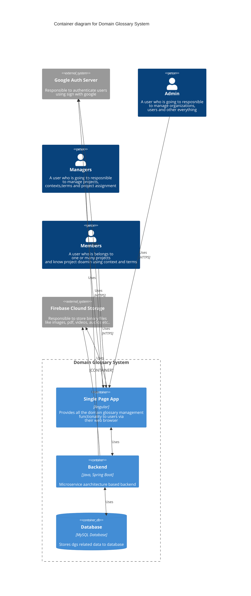

## Domain Glossary System Container Diagram

## How to View the ER Diagram

The Mermaid `erDiagram` syntax may not render properly on this site due to limitations of the current Mermaid version.

To view the ER diagram correctly, follow these steps:

---

## 📤 Steps to View in Mermaid Live Editor

1. Open the <a href="https://mermaid.live/edit" target="_blank" rel="noopener">Mermaid Live Editor</a>.
2. Copy the content below and paste it into the left-hand editor panel.
3. Click the **"Full screen"** button in the top-right to expand the diagram.

---

## 📋 Diagram Code (copy this)

